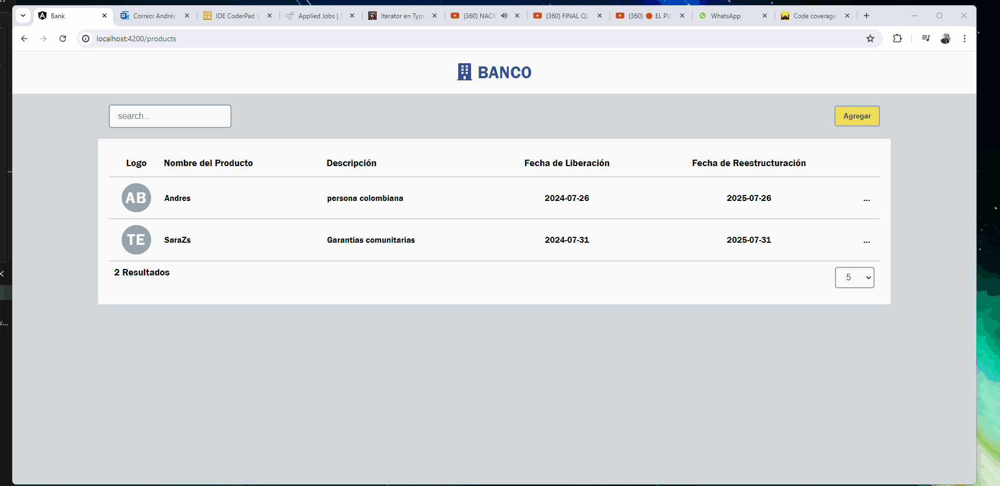
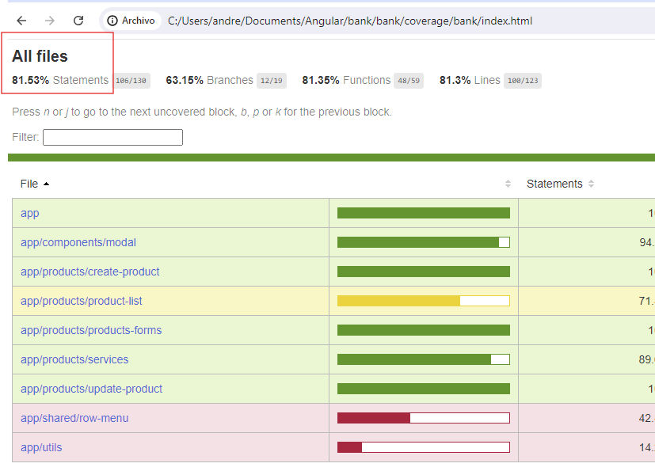

# Bank
    the pages has:
        - lazyloading
        - modules
        - responsive
##
  

## code coverage 
  
## How to run
    For running the project, First it has to be running the backend server which was provide to do this test:
    repo-interview-main

    after that: run
        npm install: for installing all dependencies
        ng serve